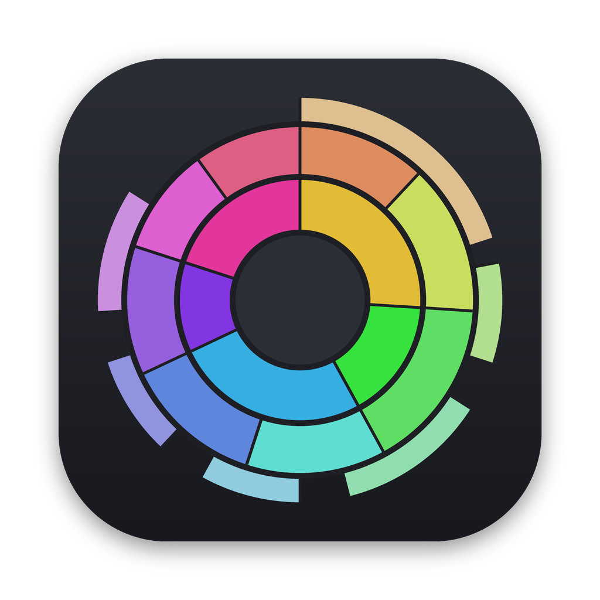
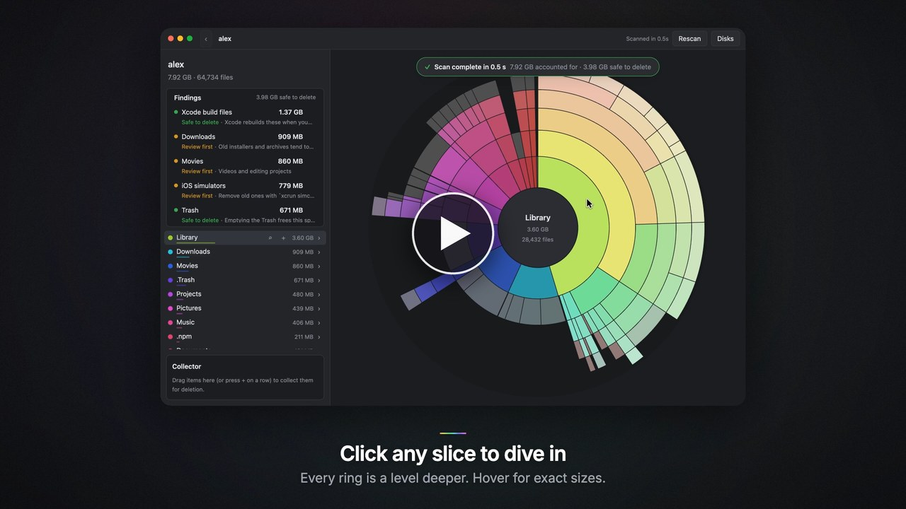
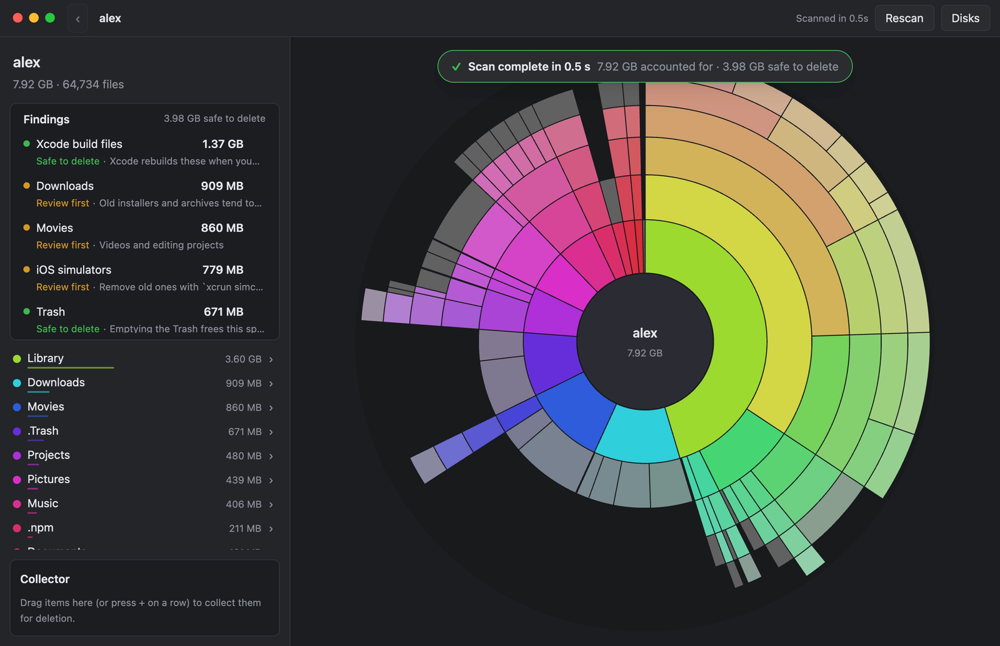
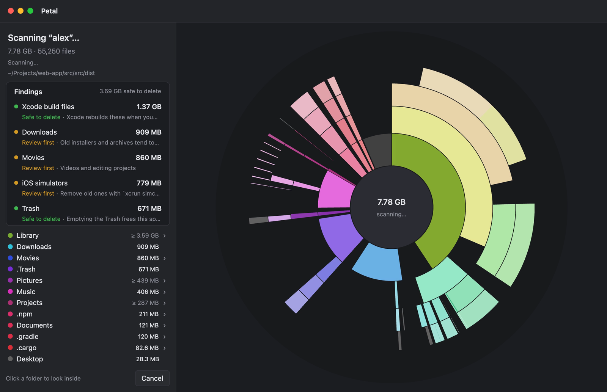
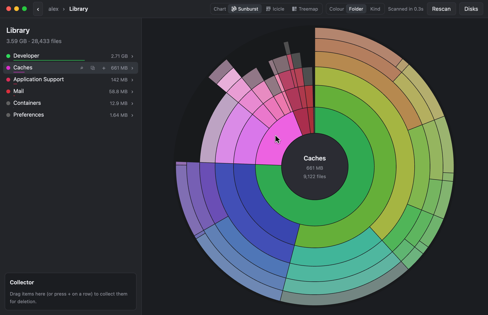
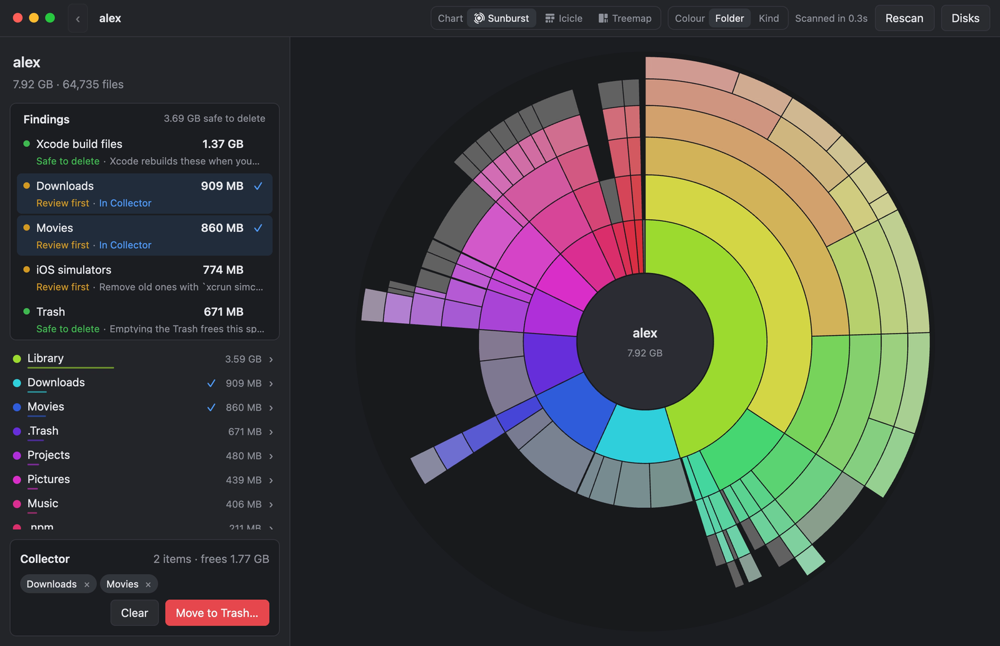
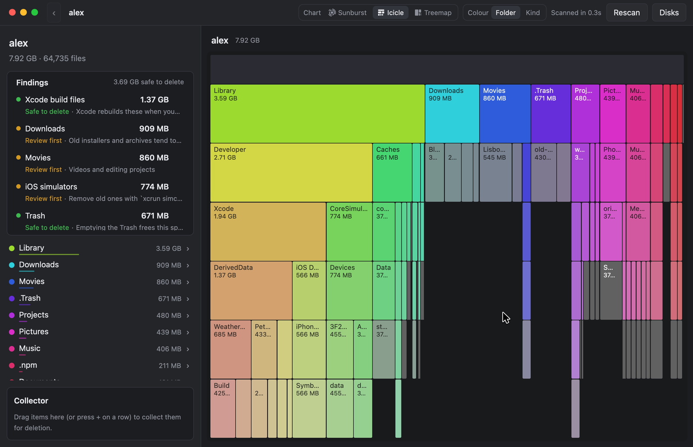
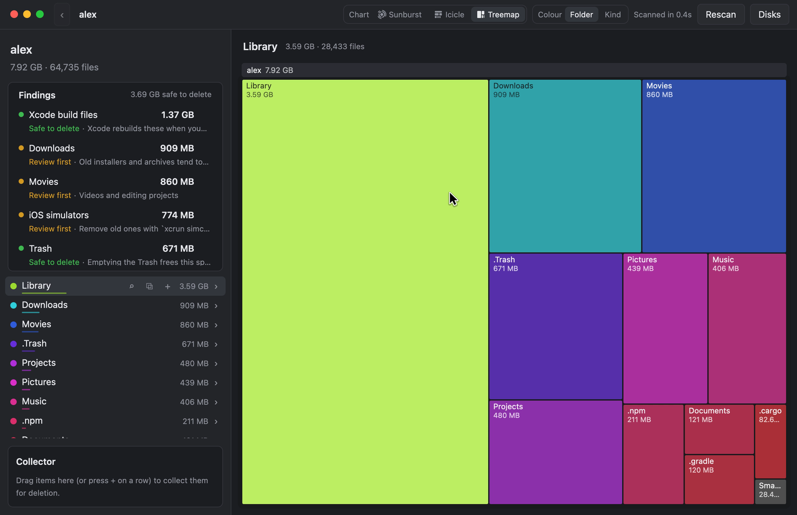
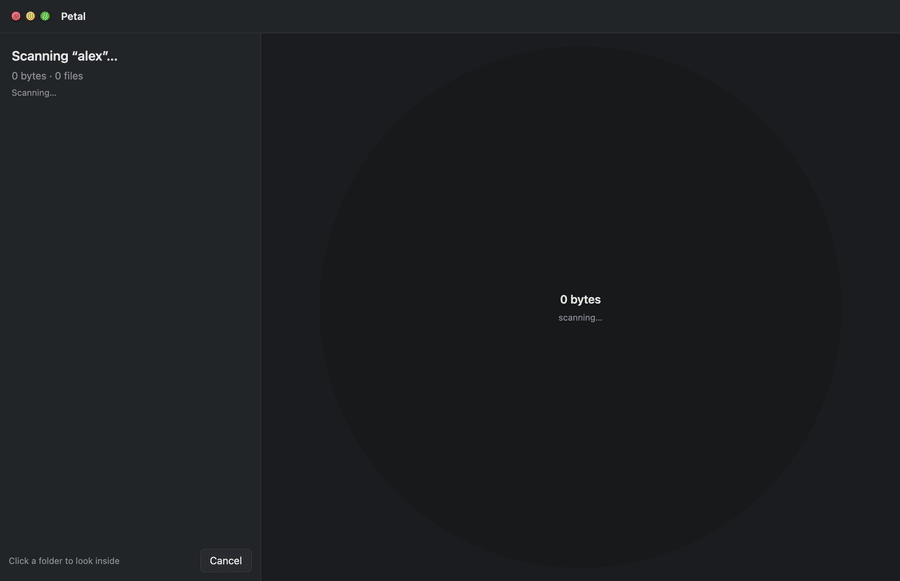

<p align="center">
  
</p>

<h1 align="center">Petal</h1>

<p align="center">
  <b>Petal tells you what's safe to delete on your Mac, why, and exactly what you'll get back.</b><br>
  A fast disk-space explorer for macOS that understands APFS clones, hard links, snapshots and purgeable space.<br>
  Free and open source, works offline, written in Rust with a GPU-rendered native UI.
</p>

<p align="center">
  <a href="https://github.com/henrydennis/petal/actions/workflows/ci.yml"></a>
  
  
  <a href="LICENSE"></a>
</p>

<p align="center">
  <a href="https://cdn.jsdelivr.net/gh/henrydennis/petal@main/docs/petal.mp4"></a><br>
  <sub>▶ <b><a href="https://cdn.jsdelivr.net/gh/henrydennis/petal@main/docs/petal.mp4">Watch Petal in 50 seconds</a></b> (with sound)</sub>
</p>

---

Petal shows your disk as a sunburst: the centre is the folder you're looking at, each ring is one
level deeper, and the size of a slice is how much space it takes. Prefer bars or boxes? The same
picture also comes as an icicle or a treemap. It draws the picture *while* it reads, tells you which
big folders are safe to clear, and tells you exactly how much deleting them will free.

## What Petal tells you

When a scan finishes, Petal lists the space hogs it found, largest first. Here are three of them as
Petal shows them (the sizes are only examples):

| Finding | Label | Why, in Petal's words | What you get back |
|---|---|---|---|
| Xcode build files | **Safe to delete** | Xcode rebuilds these when you next build | What deleting the folder frees, e.g. 14.2 GB |
| Downloads | **Review first** | Old installers and archives tend to pile up here | Whatever you pick out of it: click the finding to open the folder |
| Unpacked Git data | **Review first** | In 3 repos; `git gc` packs it | Petal deletes nothing here; it copies the `git gc` commands for you to paste in Terminal |

For findings you can delete, the size is what deleting them *really* frees, which on APFS isn't
always the folder's size. Say you have a 1 GB video and a copy of it made with Finder's
**Duplicate**. That copy is a clone: the two files share the same blocks on disk. Delete just one
and you get almost nothing back; delete both and you get 1 GB, once. Petal works this out for those
findings and for whatever you put in the Collector, counting clones and hard links once. A test
that deletes real files on a throwaway APFS volume checks this against the space actually freed. The
chart's sizes count hard links once too; like Finder, they show each clone at its full allocated
size.

## Highlights

- **Live from the first second.** The chart appears straight away and fills in as Petal reads. Folders
  turn from muted to full colour the moment their total is final. The chart grows in place as one
  piece, folds over into size order when the scan finishes, and zooms like a camera.
- **Three ways to see it.** A sunburst; an icicle, the sunburst unrolled into rows that fall from the
  folder you're in, one per level, with room for names; or a treemap, the folder's contents as boxes
  sized by the space they take. Switch with the **Chart** toggle in the toolbar or ⌘1, ⌘2, ⌘3.
- **Fast.** A whole Mac (about 6 million files) in roughly 25 seconds; a typical home folder in a few
  seconds; a 90,000-item folder in under a second. Directory listings use `getattrlistbulk` and
  `openat` across all cores. The [performance notes](docs/PERFORMANCE.md) have the measurements.
- **Exact.** Sizes are allocated blocks, so they match Finder's "on disk". For the startup disk, every
  other APFS volume (macOS itself, Preboot, VM, Recovery…) gets an exact slice, so the chart adds
  up to the disk's used space **to the byte**.
- **Findings.** Petal checks the usual suspects first (Trash, Downloads, Xcode build files and
  archives, iOS device support and simulators, iPhone backups, Docker, app caches, npm, Cargo, Gradle,
  Movies, Mail, `node_modules`, Chrome's update leftovers, Git repositories bloated with unpacked
  objects) and labels each **Safe to delete** or **Review first**, with a one-line explanation. For
  Git repositories Petal copies the `git gc` commands for you rather than deleting anything. The first ones show up within a fraction of a second.
- **Savings you can trust.** Petal quotes what deleting your selection *really* frees, counting APFS
  clones and hard links once ([how it works](#what-petal-tells-you)).
- **Snapshots and purgeable space.** On the startup disk Petal lists the APFS snapshots that keep
  deleted files' space in use, and can delete Time Machine's (macOS asks for your password). It also
  shows how much space is *purgeable*, meaning macOS frees it by itself when it needs room.
- **Collect, then clean up.** Drag folders (or press **+**) into the Collector, check the total, and
  move them to the Trash in one go. Nothing is deleted outright; you can put things back from the Trash.
- **Reads protected folders too.** Folders that belong to macOS or other users can be read as an
  administrator. Only those folders are read again, and their sizes slot into the results without a rescan.
- **Safe by design.** Petal only reads file metadata. It never downloads iCloud files that are only in
  the cloud, never sends anything over the network, and has no analytics.

## Screenshots

| | |
|---|---|
|  |  |
| **Results.** Findings, folder list and the full chart. | **Scanning.** Final folders in colour, the rest still counting. |
|  |  |
| **Explore.** Click a slice to zoom in; hover for sizes. | **Collector.** What deleting your selection frees, exactly. |
|  |  |
| **Icicle.** One row per level, falling from the folder, with names on the bars. | **Treemap.** The folder's contents as boxes sized by space; click one to go inside. |

<p align="center"><br><sub>A real scan of a sample home folder, slowed down 8×.</sub></p>

<sub>All screenshots and the video use a made-up home folder generated by
[`scripts/make-demo-home.py`](scripts/make-demo-home.py), not anyone's real files.</sub>

## Install

### Download

**[Download Petal 0.4.1 (DMG, 5.5 MB)](https://github.com/henrydennis/petal/releases/latest/download/Petal-0.4.1.dmg)** for Macs
with Apple silicon (M1 or later) running macOS 13 or later.

1. Open the DMG and drag **Petal** into **Applications**.
2. Open Petal. This build isn't notarized by Apple yet, so macOS says it can't verify the app. Click
   **Done**, then open **System Settings › Privacy & Security**, scroll down and click **Open Anyway**
   next to the message about Petal. You only need to do this once.

Notarizing Petal needs a paid Apple Developer membership. I'm working on the funds for it, and once
it's in place this extra step goes away.

All releases are on the [Releases page](https://github.com/henrydennis/petal/releases).

### Homebrew

```bash
brew install --cask henrydennis/tap/petal
```

The first time Petal opens, macOS needs the same **Open Anyway** step as above, until Petal is
notarized. Update with `brew upgrade --cask petal`.

### Build from source

It takes a couple of minutes. **You need:** macOS 13 or later, the Xcode Command Line Tools (`xcode-select --install`), and
[Rust](https://rustup.rs). The repository pins the toolchain in `rust-toolchain.toml`, so `rustup`
fetches the right version automatically.

```bash
git clone https://github.com/henrydennis/petal.git
```

```bash
cd petal && scripts/bundle.sh
```

That builds `dist/Petal.app` (signed ad hoc, so it runs on the Mac that built it). Drag it into
**Applications** and open it.
`scripts/bundle.sh --dmg` also makes a disk image.

Or run it straight from the source tree:

```bash
cargo run --release
```

### Full Disk Access

macOS keeps some folders private (Mail, Messages, Safari, other apps' data) unless an app has Full
Disk Access. Petal works without it, but shows exactly how much it couldn't read, and offers a button
that opens **System Settings › Privacy & Security › Full Disk Access**. Turn Petal on there; the card
in Petal notices within a couple of seconds and offers to rescan.

When you run Petal from a terminal (`cargo run`), macOS asks about the terminal app instead of Petal.

### Folders that belong to macOS or other users

Some folders can't be read even with Full Disk Access: other users' home folders, and parts of
`/Library` and `/private/var` that belong to macOS. Choose **File › Read Protected Folders as
Administrator…** (or click the button on the card Petal shows) and macOS asks for an administrator's
password. Petal then reads just those folders and updates the results in place. Petal itself never runs
as root. It starts a one-off copy of itself with administrator rights, which reads names and sizes,
sends them back and exits. A few folders stay private even to administrators.

### Snapshots and purgeable space

APFS snapshots are frozen copies of a volume. While a snapshot exists, deleting a file doesn't free its
space. Petal lists the startup disk's snapshots with their dates. APFS doesn't report how much space
each one holds, so when there are snapshots the slice for what Petal couldn't read is called
**Snapshots and unreadable**. Time Machine's local snapshots (a day's worth of quick undo; your backups
are elsewhere) can be deleted from the snapshots card, and Petal then tells you how much that freed.
Snapshots from macOS updates and other apps are left to whatever made them.

*Purgeable* space is space macOS frees by itself when it runs short, such as Time Machine snapshots,
iCloud files it can download again, and some caches. Petal shows it on the Disks screen and at the top of
the results. It's already included in the chart's sizes.

## Using Petal

The first time you open Petal it starts scanning your startup disk straight away. After that it opens
on the **Disks** screen, with your volumes, **Scan Home Folder** and **Choose Folder…**.

- **Hover** a slice or a row to see its size; the two stay in sync.
- **Click** a folder (in the chart or the list) to zoom in. Click the centre (the bar along the top of
  the icicle or treemap), or use the breadcrumbs, to go back up. In the treemap, a folder that holds
  little but one other folder (an app's `Contents`, say) opens straight through to what's inside.
- **Chart** in the toolbar draws the same folders as a sunburst, icicle or treemap; **Colour** colours
  them by folder or by kind.
- **Click a finding** to open its folder in the chart; press **+** on it to collect it.
- In the list, **⌕** reveals an item in Finder and **+** adds it to the Collector.
- **Move to Trash…** asks for confirmation, moves the collected items to the Trash, and updates every
  total in place without rescanning.
- **File › Read Protected Folders as Administrator…** reads the folders that couldn't be read, after
  asking for an administrator's password.

| Keys | Action |
|---|---|
| ⌘O | Choose a folder to scan |
| ⌘R | Rescan |
| ⌫, Esc or ⌘↑ | Go to the enclosing folder |
| ⇧⌘D | Back to the Disks screen |
| ⌘1, ⌘2, ⌘3 | Show the chart as a sunburst, icicle or treemap |
| ⌘Q | Quit |

You can also pass a folder on the command line: `petal ~/Library`.

## How it works

```
src/
├── main.rs        app setup, menus, key bindings, command-line flags
├── app.rs         the GPUI view: disks, scanning and results screens, sidebar, findings, collector
├── scan.rs        parallel walk (outline → hotspots → depth-first), the flat Tree, volumes, frees_of
├── dirlist.rs     getattrlistbulk/openat directory listing, with a portable fallback
├── live.rs        live per-folder totals during a scan, snapshots, and the live-chart benchmark
├── disk.rs        the startup disk's APFS container: exact slices for the other volumes, snapshots, purgeable space
├── admin.rs       reading protected folders and deleting snapshots, through a one-off administrator helper
├── findings.rs    the catalog of known space hogs and how to recognise them
├── sunburst.rs    layout in angle space; sunburst and icicle painting, hit-testing and labels; colours
├── treemap.rs     a folder's contents as squarified boxes, with their own motion and labels
├── motion.rs      easing segments between live snapshots
├── eta.rs         progress (items vs. the volume's object count) and "about N s left"
├── onboarding.rs  first run and Full Disk Access detection
├── clock.rs       the UI clock (lets the recorder pause time)
└── snapshot.rs    dev tool: scripted input, screenshots and video recording
```

1. **Outline.** The first two levels are listed by name in ~10 ms, so the chart has a shape at once.
2. **Hotspots.** Known space hogs from the findings catalog are read next, in parallel, so findings
   and the biggest slices are exact within a couple of seconds even on a full disk.
3. **Main walk.** Everything else, depth-first across all cores, reusing the hotspot results. Every
   folder in the top four levels has an atomic running total, and the UI snapshots those ten times a
   second. A folder is marked final as soon as the walk leaves it.
4. **Results.** The finished tree is a flat array of nodes. Findings resolve their exact savings in
   the background (`scan::frees_of`), and results never wait for them.

The UI is built with [GPUI](https://github.com/gpui-ce/gpui-ce) (the community edition of the
framework behind the Zed editor), which renders everything on the GPU with Metal. The chart is painted
with `PathBuilder` inside a `canvas`, and the folder list is a virtualised `uniform_list`.

## Development

```bash
cargo test                          # unit tests
cargo test -- --ignored             # plus the APFS clone-accounting test (creates and deletes a small disk image)
cargo run --release -- --bench-scan ~/Library 6   # headless scan benchmark (median of 6)
cargo run --release -- --bench-live ~/Library 3   # how soon the live chart looks right
cargo run --release -- --check-access             # does this process have Full Disk Access?
```

`bench/ab.sh` runs two builds alternately and compares their medians, and refuses to report a result
if the two scans disagree. See [docs/PERFORMANCE.md](docs/PERFORMANCE.md) for the method and the
history of what was tried.

### Screenshots and video without Screen Recording permission

With `--features snapshot`, Petal can drive its own window from a script and save PNGs, or record a
video (needs `ffmpeg`). While recording, the app's clock and the scan pause during each frame's
capture, so the video plays at the app's real speed and a smooth 30 fps no matter how long each
capture takes. `slow-motion N` records the following steps N times slower, still at 30 fps.

```bash
scripts/make-demo-home.py /tmp/demo
```

```bash
HOME=/tmp/demo/alex PETAL_HIDE_ACCESS=1 PETAL_VIDEO=/tmp/petal.mp4 \
PETAL_SCRIPT="hide-pointer; until-done 10; wait 1; show-pointer; move 1100 700; glide 904 363 1; click; wait 2; quit" \
cargo run --release --features snapshot -- /tmp/demo/alex
```

Script steps: `wait S`, `glide X Y S`, `move X Y`, `click`, `until-done MAX`, `slow-motion N`,
`hide-pointer`, `show-pointer`, `quit` (coordinates are in points within the window). For PNGs, set
`PETAL_SNAPSHOT=/tmp/petal` instead and use `shot NAME` and `burst NAME COUNT MS`.

### Packaging for other Macs

`scripts/bundle.sh` signs ad hoc by default, which is fine on the Mac that built it. To distribute,
sign with a Developer ID and notarize:

```bash
PETAL_SIGN_ID="Developer ID Application: Your Name (TEAMID)" PETAL_NOTARY_PROFILE=petal-notary scripts/bundle.sh --dmg
```

(Save the notary profile once with `xcrun notarytool store-credentials petal-notary`.) macOS ties
Full Disk Access to the code signature, so a stable Developer ID signature also keeps access granted
across updates.

## Credits

- Inspired by [DaisyDisk](https://daisydiskapp.com), which pioneered the sunburst disk explorer on
  the Mac. Petal is an independent project, not affiliated with it.
- Built on [GPUI CE](https://github.com/gpui-ce/gpui-ce), [rayon](https://github.com/rayon-rs/rayon),
  [palette](https://github.com/Ogeon/palette) and [trash](https://github.com/Byron/trash-rs).
- The promo video was edited in Tesseract with motion graphics made in
  [Remotion](https://www.remotion.dev), and narration and music from [ElevenLabs](https://elevenlabs.io).

## License

[MIT](LICENSE)
